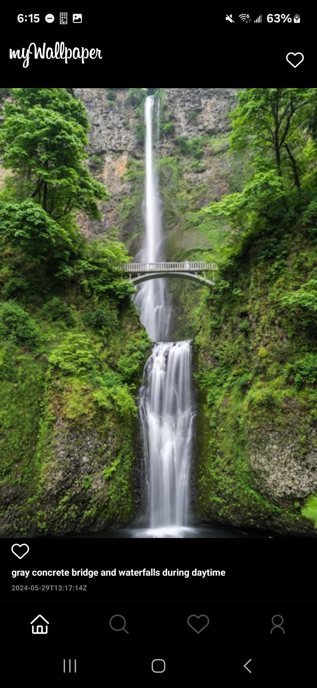

# myWallpaper

A wallpaper app that emulates the UI and functionality of "Instagram". Allows the user to view and search images via the Unsplash API.

## Features

- Light/dark mode
- Unsplash API search engine embedded

## Screenshots

Home:
<p>


</p>

Search:
<p>


</p>

Profile:
<p>


</p>

## Video Demo
<p>
<video width='270' height='600' controls>
   <source src='assets/app-imgs/Screen_Recording_20240601_182444_myWallpaper.mp4' type='video/mp4'>
</video>
<video width='270' height='600' controls>
   <source src='assets/app-imgs/Screen_Recording_20240601_182548_myWallpaper.mp4' type='video/mp4'>
</video>
</p>

## Installation

Install myWallpaper by first cloning this repo. Then:

```bash
  cd myWallpaper
  npm install
  npm start
```
    